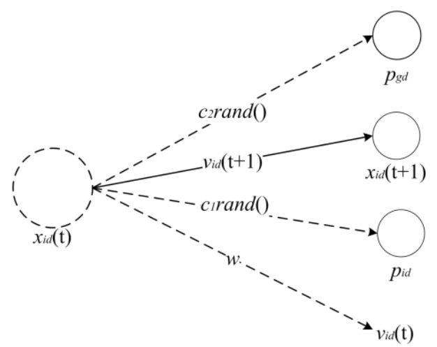
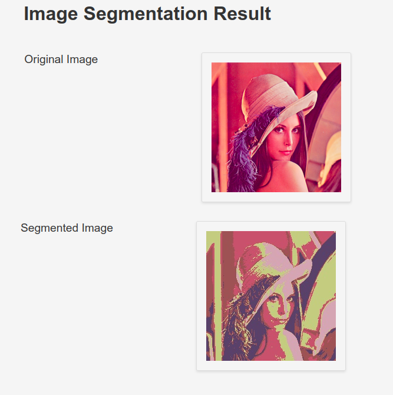
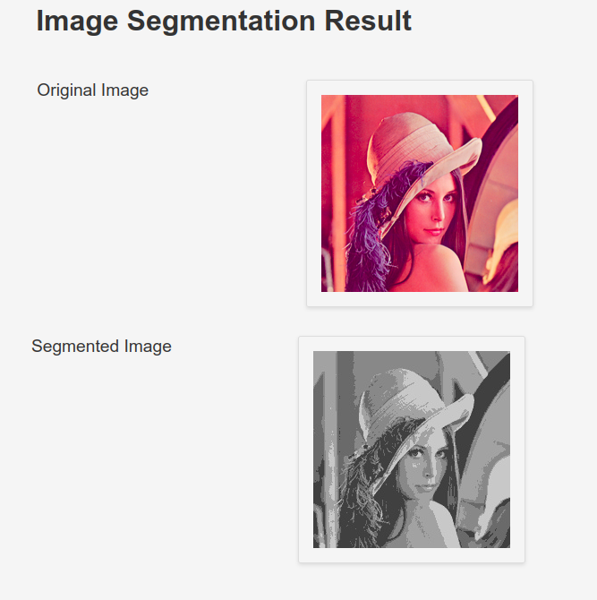

# Image Segmentation Using PSO

## Table of Content

- [Flight Fare Prediction:](#flight-fare-prediction)
  - [Table of Content](#table-of-content)
  - [Overview](#overview)
  - [What is this project about?](#motivation)
  - [🔑 Prerequisites](#key-prerequisites)
  - [📖 Data Preprocessing](#book-data-preprocessing)
  - [🚀  Installation](#-installation)
    - [💡 How to Run](#bulb-how-to-run)
  - [Results](#results)
  - [Directory Tree](#directory-tree)
  - [Technologies Used](#technologies-used)
  - [Future Scope](#future-scope)
  - [👏 And it&#39;s done!](#clap-and-its-done)
  - [🙋 Citation](#raising_hand-citation)
  - [❤️ Owner](#heart-owner)
  - [👀 License](#eyes-license)

## Overview

This is a Flask web app which shows the images after segmenting using PSO.

## What is this project about?

Particle Swarm Optimization (PSO) is a popular optimization technique inspired by the collective behavior of bird flocking or fish schooling. It is commonly used to solve optimization problems in various fields, including image processing.

Image segmentation is the process of partitioning an image into multiple segments or regions based on certain criteria, such as color, texture, or intensity. It is a fundamental task in computer vision, and it has various applications, including object recognition, image analysis, and medical imaging.

PSO can be used for image segmentation because it is a powerful optimization technique that can find the optimal segmentation parameters by searching the solution space efficiently. PSO-based image segmentation algorithms typically define the fitness function based on the similarity of the segmented



Velocity Vector Update Equation:

$$
\begin{equation}
\mathbf{v_{id}}(t+1) = w \mathbf{v_{id}}(t) + c_1 rand() \left( \mathbf{p_{id}}(t) - \mathbf{x_{id}}(t) \right) + c_2 rand() \left( \mathbf{v_{gd}}(t) - \mathbf{x_{gd}}(t) \right)
\end{equation}
$$

Position Vector Update Equation:

$$
\begin{equation}
\mathbf{x_{id}}(t+1) = \mathbf{x_{id}}(t) + \mathbf{v_{id}}(t+1)
\end{equation}
$$

Inertia Weight:

$$
\begin{equation}
w = w_{max} - \frac{w_{max} - w_{min}}{iter_{max}} \times iter
\end{equation}
$$

<hr>

## 🔑 Prerequisites

All the dependencies and required libraries are included in the file <code>requirements.txt </code> [See here](requirements.txt)

## 📖 Data Preprocessing

Data pre-processing is an important step for the creation of a machine learning
model. Initially, data may not be clean or in the required format for the model which
can cause misleading outcomes. In pre-processing of data, we transform data into our
required format. It is used to deal with noises, duplicates, and missing values of the
dataset. Data pre-processing has the activities like importing datasets, splitting
datasets, attribute scaling, etc. Preprocessing of data is required for improving the
accuracy of the model.

## 🚀&nbsp; Installation

The Code is written in Python 3.9. If you don&rsquo;t have Python installed you can find it [here](https://www.python.org/downloads/). If you are using a lower version of Python you can upgrade using the pip package, ensuring you have the latest version of pip. To install the required packages and libraries, run this command in the project directory after [cloning](https://www.howtogeek.com/451360/how-to-clone-a-github-repository/) the repository:

1. Clone the repo

```bash
git clone https://github.com/Chaganti-Reddy/ISPSO.git
```

2. Change your directory to the cloned repo

```bash
cd ISPSO
```

3. Now, run the following command in your Terminal/Command Prompt to install the libraries required

```bash
python3 -m virtualenv my_env

source my_env/bin/activate

pip3 install -r requirements.txt
```

### 💡 How to Run

1. Open terminal. Go into the cloned project directory and type the following command:

   ```bash
   python3 app.py
   ```

2. The other method is you can directly pull this project from my Dockerhub using:

   ```bash
   docker pull chagantireddy/ispso:latest
   ```

3. Then run using:

   ```bash
   docker run -it --rm -p 5000:5000 chagantireddy/ispso:latest
   ```

## Results

Color Image



<br>

Gray Scale Image



<hr>

## Directory Tree

```bash
.
├── app.py
├── Dockerfile
├── LICENSE
├── pso.py
├── Readme.md
├── requirements.txt
├── static
│   ├── segmented_image.jpg
│   └── temp.jpg
├── templates
│   ├── index.html
│   └── result.html
└── tests
    ├── image.jpg
    ├── lena.png
    └── tst.jpg

```

## Technologies Used

[](https://numpy.org/) [](https://www.python.org/) [](https://www.docker.com/)[](https://git-scm.com/)

## Future Scope

- To run it in more speed
- Optimize Flask app.py
- Optimize this Image Segmentation with different algorithm

## 👏 And it's done!

Feel free to mail me for any doubts/query
✉️ chagantivenkataramireddy1@gmail.com

---

## 🙋 Citation

You are allowed to cite any part of the code or our dataset. You can use it in your Research Work or Project. Remember to provide credit to the Maintainer Chaganti Reddy by mentioning a link to this repository and her GitHub Profile.

Follow this format:

- Author's name - Chaganti Reddy
- Date of publication or update in parentheses.
- Title or description of document.
- URL.

## ❤️ Owner

Made with ❤️&nbsp; by [Chaganti Reddy](https://github.com/Chaganti-Reddy/)

## 👀 License

MIT © [Chaganti Reddy](https://github.com/Chaganti-Reddy/ISPSO/blob/main/LICENSE)
